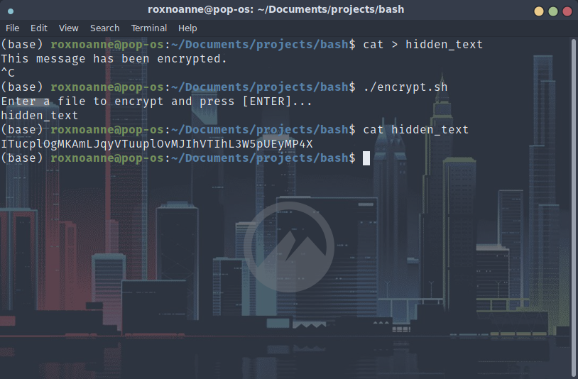

# encrypt-bash-script
This bash script asks for user input of a file, such as a text file, a zip file, or an image, then encrypts its contents. (decryption not tested on images and zip files)

#### Demonstration

***
